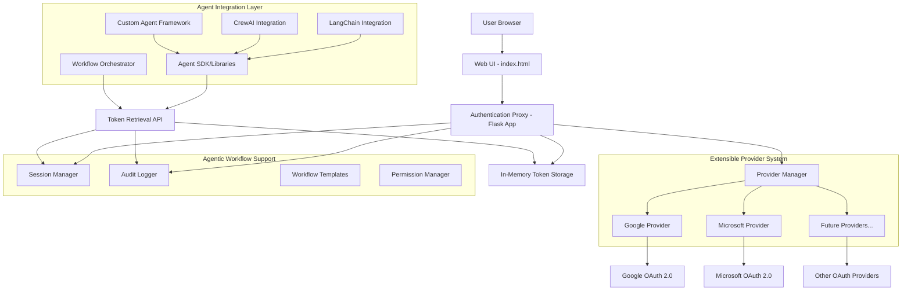
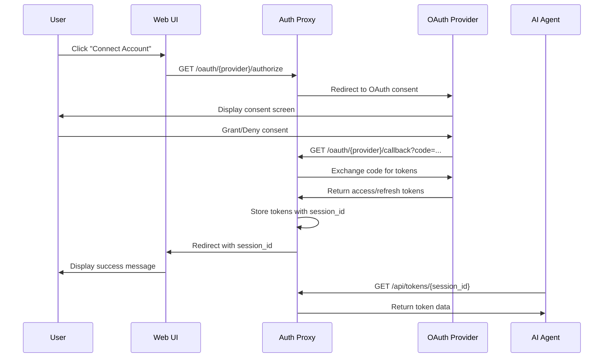

# Design Document

## Overview

The SecureContext Protocol (SCP) MVP implements an open-source, extensible OAuth 2.0 mediation system using a Flask-based Authentication Proxy with a pluggable provider architecture. The system follows a modular three-tier architecture: a simple web UI for user interaction, a Flask backend with provider abstraction for OAuth handling, and verification tools for token retrieval testing. The design prioritizes security, extensibility, and clear separation of concerns while demonstrating core SCP functionality and enabling easy integration of additional authentication providers through a standardized provider interface.

## Architecture

### High-Level Architecture



### Component Interaction Flow



## Components and Interfaces

### 1. Authentication Proxy (Flask Application)

**Core Module: `app.py`**
- Flask application initialization
- Dynamic OAuth route registration
- Token storage management
- Error handling middleware
- Provider manager integration

**Configuration Module: `config.py`**
- Environment variable loading
- Dynamic provider configuration loading
- Application settings
- Provider registry management

**Provider System: `providers/`**
- `base_provider.py` - Abstract base class for OAuth providers
- `google_provider.py` - Google OAuth 2.0 implementation
- `microsoft_provider.py` - Microsoft OAuth 2.0 implementation
- `provider_manager.py` - Provider registration and management

**Key Routes (Dynamically Generated):**
- `GET /` - Serves the web UI with all configured providers
- `GET /oauth/<provider>/authorize` - Initiates OAuth flow for any provider
- `GET /oauth/<provider>/callback` - Handles OAuth callback for any provider
- `GET /api/tokens/<session_id>` - Token retrieval endpoint
- `GET /api/providers` - Lists all configured providers
- `POST /api/agent/auth` - Programmatic OAuth initiation for agents
- `GET /api/agent/sessions` - Session management for agent workflows
- `GET /api/agent/data/<provider>/<session_id>` - Standardized data access for agents
- `GET /api/workflows/templates` - Predefined workflow authentication templates
- `GET /api/audit/<session_id>` - Audit logs for data access transparency

### 2. Web User Interface

**Template: `templates/index.html`**
- Simple HTML interface with connection buttons
- JavaScript for handling URL parameters and status display
- Basic CSS for clean presentation
- Real-time status updates based on OAuth flow results

### 3. Token Verification Script

**Script: `verify_tokens.py`**
- Command-line interface for token retrieval testing
- HTTP client for API communication
- Error handling and response formatting

## Data Models

### Token Storage Model

```python
{
    "session_id": {
        "provider": "google|microsoft",
        "access_token": "string",
        "refresh_token": "string", 
        "expires_at": "timestamp",
        "scope": "string",
        "created_at": "timestamp"
    }
}
```

### Provider Configuration Model

```python
# Base Provider Interface
class BaseProvider:
    def __init__(self, config):
        self.name = config['name']
        self.client_id = config['client_id']
        self.client_secret = config['client_secret']
        self.scopes = config['scopes']
        self.authorize_url = config['authorize_url']
        self.token_url = config['token_url']
    
    def get_authorization_url(self, state, redirect_uri):
        # Abstract method
        pass
    
    def exchange_code_for_tokens(self, code, redirect_uri):
        # Abstract method
        pass

# Provider Configuration
{
    "providers": {
        "google": {
            "name": "Google",
            "display_name": "Google Account",
            "client_id": "env:GOOGLE_CLIENT_ID",
            "client_secret": "env:GOOGLE_CLIENT_SECRET",
            "scopes": ["profile", "email", "https://www.googleapis.com/auth/gmail.readonly", "https://www.googleapis.com/auth/calendar.readonly"],
            "authorize_url": "https://accounts.google.com/o/oauth2/auth",
            "token_url": "https://oauth2.googleapis.com/token",
            "provider_class": "GoogleProvider"
        },
        "microsoft": {
            "name": "Microsoft",
            "display_name": "Microsoft Account",
            "client_id": "env:MICROSOFT_CLIENT_ID",
            "client_secret": "env:MICROSOFT_CLIENT_SECRET",
            "scopes": ["User.Read", "Mail.Read", "Calendars.Read"],
            "authorize_url": "https://login.microsoftonline.com/common/oauth2/v2.0/authorize",
            "token_url": "https://login.microsoftonline.com/common/oauth2/v2.0/token",
            "provider_class": "MicrosoftProvider"
        }
    }
}
```

### API Response Models

**Token Retrieval Response:**
```json
{
    "success": true,
    "data": {
        "access_token": "string",
        "refresh_token": "string",
        "expires_at": "ISO8601 timestamp",
        "scope": "string",
        "provider": "google|microsoft"
    }
}
```

**Error Response:**
```json
{
    "success": false,
    "error": {
        "code": "string",
        "message": "string"
    }
}
```

## Error Handling

### OAuth Flow Errors

1. **User Denial**: Redirect to UI with `error=access_denied` parameter
2. **State Mismatch**: Return 400 Bad Request with security warning
3. **Invalid Authorization Code**: Log error and redirect with generic error message
4. **Token Exchange Failure**: Handle network/API errors gracefully

### API Errors

1. **Invalid Session ID**: Return 404 with appropriate error message
2. **Expired Sessions**: Implement cleanup mechanism for old sessions
3. **Network Errors**: Provide retry mechanisms where appropriate

### Configuration Errors

1. **Missing Environment Variables**: Fail fast with clear error messages
2. **Invalid OAuth Credentials**: Detect during first OAuth attempt
3. **Port Conflicts**: Provide alternative port suggestions

## Testing Strategy

### Unit Testing

1. **OAuth Flow Testing**
   - Mock OAuth provider responses
   - Test token exchange logic
   - Validate session ID generation
   - Test error handling paths

2. **API Endpoint Testing**
   - Test token retrieval with valid/invalid session IDs
   - Test response formatting
   - Test error responses

3. **Configuration Testing**
   - Test environment variable loading
   - Test missing configuration handling
   - Test OAuth client initialization

### Integration Testing

1. **End-to-End OAuth Flow**
   - Test complete Google OAuth flow
   - Test complete Microsoft OAuth flow
   - Test UI interaction with backend

2. **Token Verification Script**
   - Test successful token retrieval
   - Test error handling
   - Test command-line argument parsing

### Manual Testing

1. **Browser Testing**
   - Test OAuth flows in different browsers
   - Test error scenarios (user denial, network issues)
   - Test UI responsiveness and feedback

2. **Security Testing**
   - Verify token storage isolation
   - Test session ID uniqueness
   - Validate OAuth state parameter usage

## Security Considerations

### Token Security

1. **In-Memory Storage**: Tokens stored only in application memory, cleared on restart
2. **Session Isolation**: Each session ID maps to isolated token storage
3. **HTTPS Enforcement**: Production deployment should enforce HTTPS
4. **Token Expiration**: Implement cleanup for expired tokens

### OAuth Security

1. **State Parameter**: Use cryptographically secure state parameter for CSRF protection
2. **Redirect URI Validation**: Strict validation of OAuth redirect URIs
3. **Scope Limitation**: Request only necessary scopes for demonstration

### API Security

1. **Session ID Validation**: Validate session ID format and existence
2. **Rate Limiting**: Consider implementing rate limiting for token retrieval endpoint
3. **CORS Configuration**: Configure appropriate CORS policies for local development

## Agentic Workflow Integration

### Agent SDK and Libraries

The SCP provides comprehensive SDK support for popular agent frameworks:

1. **Python SDK**: Core library for token management and data access
2. **LangChain Integration**: Custom tools and chains for LangChain agents
3. **CrewAI Integration**: Specialized crew member tools for multi-agent workflows
4. **AutoGen Integration**: Conversational agent tools for Microsoft AutoGen
5. **Custom Framework Support**: Generic interfaces for any agent framework

### Workflow Orchestration

**Session Management for Agents:**
- **Persistent Sessions**: Sessions that survive across multiple agent tasks
- **Context Preservation**: Maintain user context throughout workflow execution
- **Concurrent User Support**: Handle multiple users simultaneously with proper isolation
- **Session Lifecycle**: Automatic cleanup and renewal of expired sessions

**Data Access Patterns:**
- **Standardized APIs**: Consistent data access regardless of OAuth provider
- **Granular Permissions**: Fine-grained control over what data agents can access
- **Batch Operations**: Efficient bulk data retrieval for complex workflows
- **Real-time Access**: Live data streaming for dynamic agent responses

### Workflow Templates

**Predefined Authentication Patterns:**
```python
# Email Management Workflow
email_workflow = {
    "name": "email_management",
    "providers": ["google", "microsoft"],
    "scopes": {
        "google": ["gmail.readonly", "gmail.send"],
        "microsoft": ["Mail.Read", "Mail.Send"]
    },
    "permissions": ["read_emails", "send_emails", "manage_labels"]
}

# Calendar Scheduling Workflow
calendar_workflow = {
    "name": "calendar_scheduling", 
    "providers": ["google", "microsoft"],
    "scopes": {
        "google": ["calendar.readonly", "calendar.events"],
        "microsoft": ["Calendars.Read", "Calendars.ReadWrite"]
    },
    "permissions": ["read_calendar", "create_events", "update_events"]
}
```

### Agent Integration Examples

**LangChain Tool Integration:**
```python
from scp_sdk import SCPTool

# Create SCP-enabled tool for LangChain
gmail_tool = SCPTool(
    name="gmail_reader",
    description="Read and analyze Gmail messages",
    session_id="user_session_123",
    provider="google"
)

# Use in LangChain agent
agent = initialize_agent([gmail_tool], llm, agent=AgentType.ZERO_SHOT_REACT_DESCRIPTION)
```

**Multi-Agent Workflow:**
```python
from scp_sdk import WorkflowOrchestrator

# Initialize workflow with multiple user contexts
orchestrator = WorkflowOrchestrator()
orchestrator.add_user_session("user1", "session_abc")
orchestrator.add_user_session("user2", "session_xyz")

# Execute concurrent agent tasks
results = orchestrator.execute_parallel([
    ("email_agent", "user1", "summarize_inbox"),
    ("calendar_agent", "user2", "schedule_meeting")
])
```

## Extensibility Architecture

### Provider Plugin System

The SCP uses a plugin-based architecture for OAuth providers:

1. **Base Provider Interface**: All providers implement a common interface
2. **Dynamic Registration**: Providers are registered at runtime through configuration
3. **Route Generation**: OAuth routes are dynamically created for each provider
4. **UI Integration**: Provider buttons are automatically generated in the web interface

### Adding New Providers

To add a new OAuth provider:

1. Create a new provider class inheriting from `BaseProvider`
2. Implement required methods: `get_authorization_url()`, `exchange_code_for_tokens()`
3. Add provider configuration to `providers.json`
4. Set environment variables for client credentials
5. The system automatically registers routes and UI elements

### Open Source Considerations

1. **Modular Architecture**: Clear separation between core logic and provider implementations
2. **Standardized Interfaces**: Consistent APIs for adding new providers
3. **Documentation**: Comprehensive guides for contributors
4. **Testing Framework**: Automated tests for provider integrations
5. **License**: Open source license (MIT/Apache 2.0) for community contributions

## Deployment Configuration

### Development Environment

- Flask development server on localhost:5000
- Debug mode enabled for development
- Environment variables loaded from .env file
- In-memory token storage suitable for development/demo
- Hot-reload for provider configuration changes

### Environment Variables

```
# Core Application
FLASK_SECRET_KEY=your_flask_secret_key
FLASK_ENV=development

# Google Provider
GOOGLE_CLIENT_ID=your_google_client_id
GOOGLE_CLIENT_SECRET=your_google_client_secret

# Microsoft Provider
MICROSOFT_CLIENT_ID=your_microsoft_client_id
MICROSOFT_CLIENT_SECRET=your_microsoft_client_secret

# Future providers can be added by following the pattern:
# PROVIDER_NAME_CLIENT_ID=value
# PROVIDER_NAME_CLIENT_SECRET=value
```

### Dependencies

- Flask 2.3+
- Authlib 1.2+
- python-dotenv 1.0+
- requests 2.31+
- Python 3.10+
- PyYAML 6.0+ (for provider configuration)

### Production Considerations

- HTTPS enforcement for OAuth security
- Environment-specific provider configurations
- Scalable token storage (Redis/database for production)
- Load balancer support for horizontal scaling
- Container deployment (Docker) support