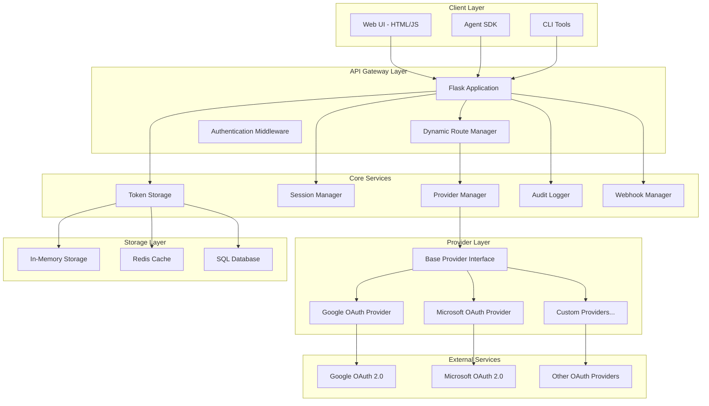

# SecureContext Protocol - Technology Stack & Architecture

## 🏗️ System Architecture Overview

The SecureContext Protocol implements a **microservices-oriented, plugin-based architecture** designed for scalability, extensibility, and enterprise deployment.



## 🐍 Core Technology Stack

### Backend Framework
- **Flask 2.3+** - Lightweight, flexible web framework
- **Python 3.10+** - Modern Python with type hints and async support
- **Authlib 1.2+** - OAuth 2.0 client library with security best practices
- **Flask-SocketIO** - Real-time WebSocket communication for streaming

### Authentication & Security
- **OAuth 2.0** - Industry standard authorization framework
- **CSRF Protection** - State parameter validation for security
- **Session Management** - Secure session handling with UUID4 identifiers
- **Token Encryption** - Secure token storage and transmission

### Data Storage & Caching
- **In-Memory Storage** - Default development storage (Python dict with threading.Lock)
- **Redis** - Production caching and session storage (19K+ ops/sec validated)
- **SQLite/PostgreSQL** - Persistent database storage (190K+ ops/sec validated)
- **Connection Pooling** - Optimized database connections for scalability

### API & Communication
- **RESTful APIs** - Standard HTTP methods and status codes
- **JSON Responses** - Structured API responses with error handling
- **WebSocket Streaming** - Real-time data streaming for agents
- **Webhook Notifications** - Event-driven external system integration

## 🔧 Architecture Patterns

### 1. Plugin Architecture
```python
# Base Provider Interface
class BaseProvider(ABC):
    @abstractmethod
    def get_authorization_url(self, state: str, redirect_uri: str) -> str:
        pass
    
    @abstractmethod
    def exchange_code_for_tokens(self, code: str, redirect_uri: str) -> Dict[str, Any]:
        pass
```

**Benefits:**
- Easy addition of new OAuth providers
- Consistent interface across all providers
- Runtime provider registration and discovery

### 2. Factory Pattern
```python
class ProviderManager:
    def create_provider(self, provider_name: str, config: Dict) -> BaseProvider:
        provider_class = self.provider_classes.get(provider_name)
        return provider_class(config)
```

**Benefits:**
- Dynamic provider instantiation
- Configuration-driven provider creation
- Centralized provider lifecycle management

### 3. Observer Pattern
```python
class WebhookManager:
    def notify_token_retrieved(self, session_id: str, provider: str, metadata: Dict):
        for webhook in self.webhooks:
            webhook.send_notification(event_type="token_retrieved", data=...)
```

**Benefits:**
- Decoupled event notification system
- Extensible webhook integrations
- Real-time system monitoring

### 4. Strategy Pattern
```python
class SessionStorage:
    def __init__(self, storage_strategy: StorageStrategy):
        self.storage = storage_strategy
    
    def store_token(self, session_id: str, token_data: Dict):
        return self.storage.store(session_id, token_data)
```

**Benefits:**
- Pluggable storage backends
- Environment-specific storage strategies
- Performance optimization flexibility

## 🚀 Deployment Architecture

### Development Environment
```yaml
Architecture: Single-node Flask development server
Storage: In-memory Python dictionaries
Security: Basic HTTPS with self-signed certificates
Scaling: Single process, single thread
Monitoring: Console logging
```

### Production Environment
```yaml
Architecture: Multi-node containerized deployment
Load Balancer: Nginx/HAProxy with SSL termination
Application: Gunicorn WSGI server with multiple workers
Storage: Redis cluster + PostgreSQL with connection pooling
Security: SSL/TLS, security headers, rate limiting
Monitoring: Prometheus + Grafana, structured logging
Scaling: Horizontal pod autoscaling (HPA)
```

## 🐳 Containerization & Orchestration

### Docker Architecture
```dockerfile
# Multi-stage build for optimization
FROM python:3.11-slim as builder
# Dependencies installation and optimization
FROM python:3.11-slim as runtime
# Minimal runtime with security hardening
```

**Features:**
- Multi-stage builds for minimal image size
- Non-root user execution for security
- Health checks and graceful shutdown
- Environment-specific configurations

### Kubernetes Deployment
```yaml
apiVersion: apps/v1
kind: Deployment
metadata:
  name: scp-authentication-proxy
spec:
  replicas: 3
  strategy:
    type: RollingUpdate
    rollingUpdate:
      maxSurge: 1
      maxUnavailable: 0
```

**Components:**
- **Deployment** - Application pods with rolling updates
- **Service** - Internal load balancing and service discovery
- **Ingress** - External traffic routing with SSL termination
- **ConfigMap** - Configuration management
- **Secret** - Secure credential storage
- **HPA** - Horizontal Pod Autoscaler for dynamic scaling

## 🔌 Integration Architecture

### Agent Framework Integrations

#### LangChain Integration
```python
from scp_sdk.integrations.langchain import SCPTool

class SCPGmailTool(SCPTool):
    name = "gmail_reader"
    description = "Read Gmail messages with SCP authentication"
    
    def _run(self, query: str) -> str:
        # Secure data access through SCP
        return self.scp_client.get_gmail_data(query)
```

#### CrewAI Integration
```python
from scp_sdk.integrations.crewai import SCPCrewTool

@scp_authenticated(provider="google", scopes=["gmail.readonly"])
def email_analyzer_tool(session_id: str, query: str) -> str:
    # Multi-agent workflow with secure context
    pass
```

#### AutoGen Integration
```python
from scp_sdk.integrations.autogen import SCPConversableAgent

agent = SCPConversableAgent(
    name="email_assistant",
    scp_session_id="user_session_123",
    system_message="You can access user's Gmail data securely"
)
```

### Enterprise Integration Patterns

#### Webhook Architecture
```python
# Event-driven integration
POST /webhooks/token-events
{
    "event_type": "token_retrieved",
    "session_id": "uuid4",
    "provider": "google",
    "timestamp": "2024-01-01T00:00:00Z",
    "metadata": {...}
}
```

#### Streaming Architecture
```python
# Real-time data streaming
WebSocket: /api/stream/data
{
    "stream_id": "uuid4",
    "provider": "google",
    "data_type": "gmail_messages",
    "filters": {...}
}
```

## 📊 Performance Architecture

### Caching Strategy
```python
# Multi-level caching
L1: In-memory application cache (fastest)
L2: Redis distributed cache (fast)
L3: Database with indexing (persistent)
```

### Connection Pooling
```python
# Database connection optimization
redis_pool = redis.ConnectionPool(
    host='redis-cluster',
    port=6379,
    max_connections=100,
    retry_on_timeout=True
)
```

### Load Balancing
```yaml
# Nginx configuration
upstream scp_backend {
    least_conn;
    server scp-pod-1:5000 weight=1;
    server scp-pod-2:5000 weight=1;
    server scp-pod-3:5000 weight=1;
}
```

## 🔒 Security Architecture

### OAuth 2.0 Security
- **PKCE (Proof Key for Code Exchange)** - Enhanced security for public clients
- **State Parameter Validation** - CSRF protection with cryptographic randomness
- **Scope Limitation** - Principle of least privilege for data access
- **Token Rotation** - Automatic refresh token rotation

### Application Security
- **Input Validation** - Comprehensive request validation and sanitization
- **Rate Limiting** - API endpoint protection against abuse
- **Security Headers** - HSTS, CSP, X-Frame-Options, etc.
- **Audit Logging** - Complete audit trail for compliance

### Infrastructure Security
- **TLS/SSL Encryption** - End-to-end encryption for all communications
- **Network Segmentation** - Isolated network zones for different components
- **Secret Management** - Kubernetes secrets and external secret managers
- **Container Security** - Non-root execution, minimal base images

## 📈 Monitoring & Observability

### Logging Architecture
```python
# Structured logging with correlation IDs
{
    "timestamp": "2024-01-01T00:00:00Z",
    "level": "INFO",
    "service": "authentication-proxy",
    "correlation_id": "uuid4",
    "event": "token_retrieved",
    "session_id": "uuid4",
    "provider": "google"
}
```

### Metrics Collection
- **Application Metrics** - Request rates, response times, error rates
- **Business Metrics** - Token operations, provider usage, session counts
- **Infrastructure Metrics** - CPU, memory, network, storage utilization
- **Custom Metrics** - OAuth flow success rates, provider performance

### Health Checks
```python
# Kubernetes health checks
/health/live    # Liveness probe
/health/ready   # Readiness probe
/health/startup # Startup probe
```

## 🔄 CI/CD Architecture

### Pipeline Stages
1. **Code Quality** - Linting, type checking, security scanning
2. **Testing** - Unit tests, integration tests, performance tests
3. **Build** - Docker image creation and optimization
4. **Security** - Vulnerability scanning, dependency checks
5. **Deploy** - Automated deployment to staging/production
6. **Monitor** - Post-deployment health checks and monitoring

### Testing Strategy
- **Unit Tests** - Individual component testing with mocking
- **Integration Tests** - End-to-end OAuth flow testing
- **Performance Tests** - Load testing up to 100 concurrent users
- **Security Tests** - Vulnerability scanning and penetration testing
- **Contract Tests** - API contract validation

## 🌐 Scalability Architecture

### Horizontal Scaling
- **Stateless Design** - No server-side session affinity required
- **Load Distribution** - Even request distribution across pods
- **Auto-scaling** - CPU/memory-based horizontal pod autoscaling
- **Database Scaling** - Read replicas and connection pooling

### Performance Optimization
- **Caching** - Multi-level caching strategy for optimal performance
- **Connection Pooling** - Optimized database and Redis connections
- **Async Processing** - Non-blocking I/O for improved throughput
- **Resource Limits** - Proper CPU and memory limits for stability

## 📋 Technology Dependencies

### Core Dependencies
```
Flask==2.3.3              # Web framework
Authlib==1.2.1            # OAuth 2.0 client
python-dotenv==1.0.0      # Environment configuration
requests==2.31.0          # HTTP client
redis==4.6.0              # Redis client
psycopg2-binary==2.9.7    # PostgreSQL adapter
gunicorn==21.2.0          # WSGI server
```

### Development Dependencies
```
pytest==7.4.2            # Testing framework
pytest-cov==4.1.0        # Coverage reporting
black==23.7.0             # Code formatting
flake8==6.0.0             # Linting
mypy==1.5.1               # Type checking
```

### Production Dependencies
```
prometheus-client==0.17.1 # Metrics collection
structlog==23.1.0         # Structured logging
sentry-sdk==1.32.0        # Error tracking
```

This technology stack provides a robust, scalable, and secure foundation for the SecureContext Protocol, enabling enterprise-grade OAuth 2.0 mediation with comprehensive agent integration capabilities.