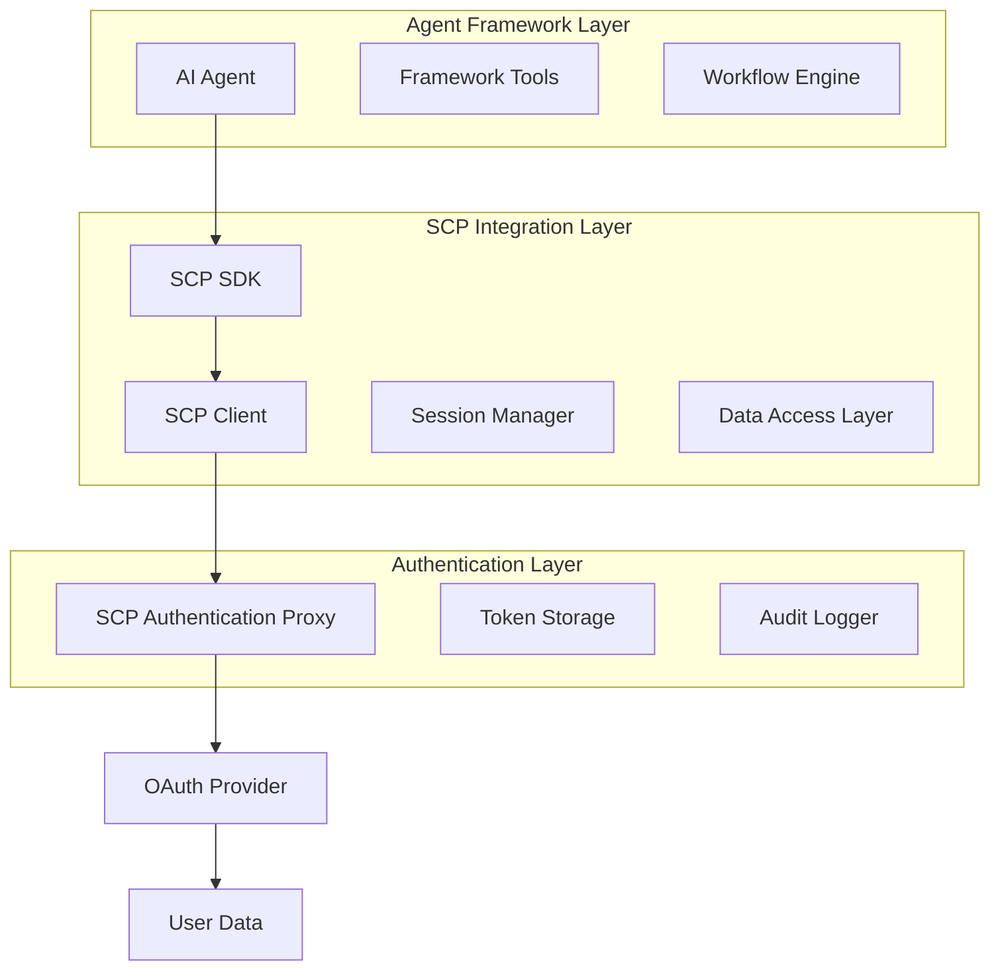

# Agent Integration Patterns for SecureContext Protocol (SCP)

This document provides comprehensive guidance on integrating SCP with various agent frameworks and architectures. It covers common patterns, best practices, and implementation strategies for different use cases.

## Table of Contents

1. [Integration Architecture Overview](#integration-architecture-overview)
2. [Framework-Specific Patterns](#framework-specific-patterns)
3. [Common Integration Patterns](#common-integration-patterns)
4. [Session Management Patterns](#session-management-patterns)
5. [Error Handling Patterns](#error-handling-patterns)
6. [Security Patterns](#security-patterns)
7. [Performance Optimization Patterns](#performance-optimization-patterns)

## Integration Architecture Overview

### Basic Integration Flow



### Core Integration Components

1. **SCP SDK**: Framework-agnostic Python library for SCP integration
2. **Framework Adapters**: Specialized integrations for popular agent frameworks
3. **Session Manager**: Handles user session lifecycle and context preservation
4. **Data Access Layer**: Provides standardized access to user data across providers
5. **Audit Logger**: Tracks all data access for transparency and compliance

## Framework-Specific Patterns

### LangChain Integration Pattern

#### Tool-Based Integration
```python
from langchain.tools import BaseTool
from scp_sdk.integrations.langchain import SCPTool

# Create SCP-enabled tool
gmail_tool = SCPTool(
    name="gmail_reader",
    description="Read Gmail messages",
    session_id="user_session_123",
    provider="google",
    data_type="emails"
)

# Use in agent
from langchain.agents import initialize_agent, AgentType
agent = initialize_agent([gmail_tool], llm, agent=AgentType.ZERO_SHOT_REACT_DESCRIPTION)
```

#### Chain-Based Integration
```python
from scp_sdk.integrations.langchain import SCPChain

# Create specialized chain for email processing
email_chain = SCPChain(
    session_id="user_session_123",
    providers=["google", "microsoft"],
    chain_type="email_processing"
)

# Execute chain
result = email_chain.run("Summarize my recent emails")
```

#### Custom Tool Pattern
```python
from langchain.tools import BaseTool
from scp_sdk import SCPClient

class CustomSCPTool(BaseTool):
    name = "custom_scp_tool"
    description = "Custom tool with SCP integration"
    
    def __init__(self, session_id: str):
        super().__init__()
        self.scp_client = SCPClient()
        self.session_id = session_id
    
    def _run(self, query: str) -> str:
        # Custom logic using SCP client
        data = self.scp_client.get_data(
            session_id=self.session_id,
            provider="google",
            data_type="emails",
            query=query
        )
        return self._process_data(data)
    
    def _process_data(self, data):
        # Custom data processing logic
        return f"Processed {len(data)} items"
```

### CrewAI Integration Pattern

#### Agent-Based Integration
```python
from crewai import Agent
from scp_sdk.integrations.crewai import SCPAgent, SCPCrewTool

class EmailAnalystAgent(SCPAgent):
    def __init__(self, session_id: str):
        super().__init__(
            role="Email Analyst",
            goal="Analyze email patterns and trends",
            backstory="Expert email analyst with access to user data",
            session_id=session_id,
            providers=["google", "microsoft"]
        )
        
        # Add SCP tools
        self.tools = [
            SCPCrewTool(
                name="email_reader",
                description="Read emails from connected accounts",
                session_id=session_id,
                provider="auto"
            )
        ]
```

#### Multi-Agent Workflow Pattern
```python
from crewai import Crew, Task, Process

def create_email_processing_crew(session_id: str):
    # Create specialized agents
    analyst = EmailAnalystAgent(session_id)
    coordinator = CommunicationCoordinatorAgent(session_id)
    
    # Define collaborative tasks
    analysis_task = Task(
        description="Analyze email patterns and identify important messages",
        agent=analyst,
        expected_output="Email analysis report with priority classifications"
    )
    
    response_task = Task(
        description="Draft responses for high-priority emails",
        agent=coordinator,
        expected_output="Draft responses and follow-up schedule"
    )
    
    # Create crew
    crew = Crew(
        agents=[analyst, coordinator],
        tasks=[analysis_task, response_task],
        process=Process.sequential
    )
    
    return crew
```

### AutoGen Integration Pattern

#### Function Calling Pattern
```python
from autogen import AssistantAgent
from scp_sdk.integrations.autogen import SCPFunctionCall

class SCPAssistantAgent(AssistantAgent):
    def __init__(self, session_id: str, **kwargs):
        super().__init__(**kwargs)
        self.session_id = session_id
        self._register_scp_functions()
    
    def _register_scp_functions(self):
        scp_functions = [
            {
                "name": "read_emails",
                "description": "Read emails from connected providers",
                "parameters": {
                    "type": "object",
                    "properties": {
                        "provider": {"type": "string"},
                        "query": {"type": "string"}
                    }
                }
            }
        ]
        
        for func in scp_functions:
            self.register_function(
                function_map={func["name"]: self._create_scp_function(func["name"])},
                function_schema=func
            )
    
    def _create_scp_function(self, function_name: str):
        def scp_function(**kwargs):
            return SCPFunctionCall.execute(
                function_name=function_name,
                session_id=self.session_id,
                **kwargs
            )
        return scp_function
```

#### Group Chat Pattern
```python
from autogen import GroupChat, GroupChatManager

def create_scp_group_chat(session_id: str):
    # Create SCP-enabled agents
    email_agent = SCPAssistantAgent(
        name="EmailAgent",
        session_id=session_id,
        system_message="You handle email-related tasks"
    )
    
    calendar_agent = SCPAssistantAgent(
        name="CalendarAgent", 
        session_id=session_id,
        system_message="You handle calendar-related tasks"
    )
    
    # Create group chat
    groupchat = GroupChat(
        agents=[email_agent, calendar_agent],
        messages=[],
        max_round=10
    )
    
    manager = GroupChatManager(groupchat=groupchat)
    return manager
```

## Common Integration Patterns

### 1. Single-Provider Pattern
Use when working with data from one OAuth provider:

```python
from scp_sdk import SCPClient

class SingleProviderAgent:
    def __init__(self, session_id: str, provider: str):
        self.scp_client = SCPClient()
        self.session_id = session_id
        self.provider = provider
    
    def get_emails(self, query: str = "recent"):
        return self.scp_client.get_data(
            session_id=self.session_id,
            provider=self.provider,
            data_type="emails",
            query=query
        )
```

### 2. Multi-Provider Pattern
Use when aggregating data from multiple providers:

```python
class MultiProviderAgent:
    def __init__(self, session_id: str, providers: List[str]):
        self.scp_client = SCPClient()
        self.session_id = session_id
        self.providers = providers
    
    def get_all_emails(self, query: str = "recent"):
        all_emails = []
        for provider in self.providers:
            try:
                emails = self.scp_client.get_data(
                    session_id=self.session_id,
                    provider=provider,
                    data_type="emails",
                    query=query
                )
                all_emails.extend(emails)
            except Exception as e:
                print(f"Error accessing {provider}: {e}")
        return all_emails
```

### 3. Workflow Template Pattern
Use predefined templates for common workflows:

```python
from scp_sdk import WorkflowOrchestrator

class TemplateBasedAgent:
    def __init__(self, session_id: str):
        self.orchestrator = WorkflowOrchestrator()
        self.session_id = session_id
    
    def execute_email_workflow(self):
        return self.orchestrator.execute_template(
            template_name="email_management",
            session_id=self.session_id,
            parameters={
                "analysis_depth": "detailed",
                "response_mode": "draft_only"
            }
        )
```

### 4. Streaming Data Pattern
Use for real-time data processing:

```python
import asyncio
from scp_sdk import SCPStreamingClient

class StreamingAgent:
    def __init__(self, session_id: str):
        self.streaming_client = SCPStreamingClient()
        self.session_id = session_id
    
    async def process_email_stream(self):
        async for email in self.streaming_client.stream_emails(
            session_id=self.session_id,
            providers=["google", "microsoft"]
        ):
            await self.process_email(email)
    
    async def process_email(self, email):
        # Process individual email
        print(f"Processing email: {email['subject']}")
```

## Session Management Patterns

### 1. Single-User Session Pattern
```python
from scp_sdk import SessionManager

class SingleUserAgent:
    def __init__(self, user_id: str):
        self.session_manager = SessionManager()
        self.session_id = self.session_manager.create_session(user_id)
    
    def cleanup(self):
        self.session_manager.cleanup_session(self.session_id)
```

### 2. Multi-User Session Pattern
```python
class MultiUserAgent:
    def __init__(self):
        self.session_manager = SessionManager()
        self.user_sessions = {}
    
    def add_user(self, user_id: str):
        session_id = self.session_manager.create_session(user_id)
        self.user_sessions[user_id] = session_id
        return session_id
    
    def process_user_data(self, user_id: str, task: str):
        session_id = self.user_sessions.get(user_id)
        if not session_id:
            raise ValueError(f"No session for user {user_id}")
        
        # Process data for specific user
        return self.execute_task(session_id, task)
```

### 3. Session Pool Pattern
```python
from scp_sdk import SessionPool

class HighThroughputAgent:
    def __init__(self, pool_size: int = 10):
        self.session_pool = SessionPool(max_size=pool_size)
    
    async def process_batch(self, tasks: List[Dict]):
        async with self.session_pool.get_session() as session:
            results = []
            for task in tasks:
                result = await self.process_task(session, task)
                results.append(result)
            return results
```

## Error Handling Patterns

### 1. Retry Pattern
```python
import time
from typing import Callable, Any

class RetryableAgent:
    def __init__(self, session_id: str, max_retries: int = 3):
        self.scp_client = SCPClient()
        self.session_id = session_id
        self.max_retries = max_retries
    
    def with_retry(self, func: Callable, *args, **kwargs) -> Any:
        for attempt in range(self.max_retries):
            try:
                return func(*args, **kwargs)
            except Exception as e:
                if attempt == self.max_retries - 1:
                    raise e
                time.sleep(2 ** attempt)  # Exponential backoff
```

### 2. Circuit Breaker Pattern
```python
from datetime import datetime, timedelta

class CircuitBreakerAgent:
    def __init__(self, session_id: str, failure_threshold: int = 5):
        self.scp_client = SCPClient()
        self.session_id = session_id
        self.failure_threshold = failure_threshold
        self.failure_count = 0
        self.last_failure_time = None
        self.circuit_open = False
    
    def call_with_circuit_breaker(self, func: Callable, *args, **kwargs):
        if self.circuit_open:
            if datetime.now() - self.last_failure_time > timedelta(minutes=5):
                self.circuit_open = False
                self.failure_count = 0
            else:
                raise Exception("Circuit breaker is open")
        
        try:
            result = func(*args, **kwargs)
            self.failure_count = 0
            return result
        except Exception as e:
            self.failure_count += 1
            self.last_failure_time = datetime.now()
            
            if self.failure_count >= self.failure_threshold:
                self.circuit_open = True
            
            raise e
```

### 3. Graceful Degradation Pattern
```python
class ResilientAgent:
    def __init__(self, session_id: str):
        self.scp_client = SCPClient()
        self.session_id = session_id
        self.fallback_enabled = True
    
    def get_emails_with_fallback(self, preferred_provider: str = "google"):
        providers = ["google", "microsoft"]
        
        # Try preferred provider first
        if preferred_provider in providers:
            providers.remove(preferred_provider)
            providers.insert(0, preferred_provider)
        
        for provider in providers:
            try:
                return self.scp_client.get_data(
                    session_id=self.session_id,
                    provider=provider,
                    data_type="emails"
                )
            except Exception as e:
                print(f"Failed to access {provider}: {e}")
                continue
        
        # If all providers fail, return cached data or empty result
        return self.get_cached_emails() if self.fallback_enabled else []
```

## Security Patterns

### 1. Token Validation Pattern
```python
class SecureAgent:
    def __init__(self, session_id: str):
        self.scp_client = SCPClient()
        self.session_id = session_id
    
    def validate_session(self) -> bool:
        try:
            session_info = self.scp_client.get_session_info(self.session_id)
            return session_info.get("valid", False)
        except Exception:
            return False
    
    def secure_data_access(self, provider: str, data_type: str):
        if not self.validate_session():
            raise SecurityError("Invalid session")
        
        return self.scp_client.get_data(
            session_id=self.session_id,
            provider=provider,
            data_type=data_type
        )
```

### 2. Audit Logging Pattern
```python
from scp_sdk import AuditLogger

class AuditableAgent:
    def __init__(self, session_id: str):
        self.scp_client = SCPClient()
        self.session_id = session_id
        self.audit_logger = AuditLogger()
    
    def access_data_with_audit(self, provider: str, data_type: str, purpose: str):
        # Log data access attempt
        self.audit_logger.log_access_attempt(
            session_id=self.session_id,
            provider=provider,
            data_type=data_type,
            purpose=purpose
        )
        
        try:
            data = self.scp_client.get_data(
                session_id=self.session_id,
                provider=provider,
                data_type=data_type
            )
            
            # Log successful access
            self.audit_logger.log_access_success(
                session_id=self.session_id,
                provider=provider,
                data_type=data_type,
                records_accessed=len(data)
            )
            
            return data
        except Exception as e:
            # Log access failure
            self.audit_logger.log_access_failure(
                session_id=self.session_id,
                provider=provider,
                data_type=data_type,
                error=str(e)
            )
            raise
```

### 3. Permission Validation Pattern
```python
class PermissionAwareAgent:
    def __init__(self, session_id: str):
        self.scp_client = SCPClient()
        self.session_id = session_id
    
    def check_permissions(self, provider: str, data_type: str) -> bool:
        try:
            permissions = self.scp_client.get_session_permissions(self.session_id)
            return permissions.get(provider, {}).get(data_type, False)
        except Exception:
            return False
    
    def safe_data_access(self, provider: str, data_type: str):
        if not self.check_permissions(provider, data_type):
            raise PermissionError(f"No permission for {provider}:{data_type}")
        
        return self.scp_client.get_data(
            session_id=self.session_id,
            provider=provider,
            data_type=data_type
        )
```

## Performance Optimization Patterns

### 1. Caching Pattern
```python
from functools import lru_cache
from datetime import datetime, timedelta

class CachingAgent:
    def __init__(self, session_id: str):
        self.scp_client = SCPClient()
        self.session_id = session_id
        self.cache = {}
        self.cache_ttl = timedelta(minutes=5)
    
    def get_cached_data(self, provider: str, data_type: str, query: str = None):
        cache_key = f"{provider}:{data_type}:{query}"
        
        if cache_key in self.cache:
            data, timestamp = self.cache[cache_key]
            if datetime.now() - timestamp < self.cache_ttl:
                return data
        
        # Fetch fresh data
        data = self.scp_client.get_data(
            session_id=self.session_id,
            provider=provider,
            data_type=data_type,
            query=query
        )
        
        # Cache the result
        self.cache[cache_key] = (data, datetime.now())
        return data
```

### 2. Batch Processing Pattern
```python
import asyncio
from typing import List, Dict

class BatchProcessingAgent:
    def __init__(self, session_id: str, batch_size: int = 10):
        self.scp_client = SCPClient()
        self.session_id = session_id
        self.batch_size = batch_size
    
    async def process_batch(self, requests: List[Dict]) -> List[Any]:
        results = []
        
        for i in range(0, len(requests), self.batch_size):
            batch = requests[i:i + self.batch_size]
            batch_tasks = [self.process_single_request(req) for req in batch]
            batch_results = await asyncio.gather(*batch_tasks, return_exceptions=True)
            results.extend(batch_results)
        
        return results
    
    async def process_single_request(self, request: Dict) -> Any:
        return await asyncio.to_thread(
            self.scp_client.get_data,
            session_id=self.session_id,
            **request
        )
```

### 3. Connection Pooling Pattern
```python
from concurrent.futures import ThreadPoolExecutor
import threading

class PooledAgent:
    def __init__(self, session_id: str, max_workers: int = 5):
        self.scp_client = SCPClient()
        self.session_id = session_id
        self.executor = ThreadPoolExecutor(max_workers=max_workers)
        self.local = threading.local()
    
    def get_client(self):
        if not hasattr(self.local, 'client'):
            self.local.client = SCPClient()
        return self.local.client
    
    def parallel_data_access(self, requests: List[Dict]) -> List[Any]:
        futures = []
        
        for request in requests:
            future = self.executor.submit(self.fetch_data, request)
            futures.append(future)
        
        results = [future.result() for future in futures]
        return results
    
    def fetch_data(self, request: Dict) -> Any:
        client = self.get_client()
        return client.get_data(
            session_id=self.session_id,
            **request
        )
```

## Best Practices Summary

1. **Always validate sessions** before accessing user data
2. **Implement proper error handling** with retries and fallbacks
3. **Use audit logging** for transparency and compliance
4. **Cache frequently accessed data** to improve performance
5. **Handle multiple providers gracefully** with fallback mechanisms
6. **Implement proper cleanup** for sessions and resources
7. **Use connection pooling** for high-throughput scenarios
8. **Follow the principle of least privilege** for data access
9. **Implement circuit breakers** for external service calls
10. **Monitor and log all SCP interactions** for debugging and optimization

These patterns provide a solid foundation for integrating SCP with various agent frameworks while maintaining security, performance, and reliability.